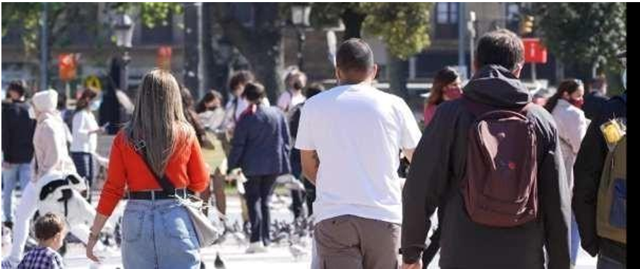
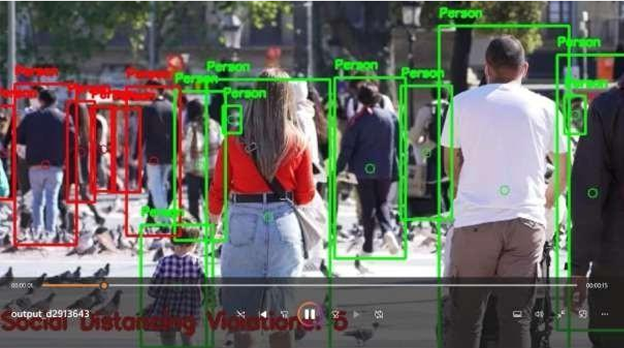

📌 Social Distancing Detection System
🚀 Description
A real-time computer vision system that monitors social distancing using video streams. The application detects people using the YOLO model and calculates the distance between individuals to identify violations.

🧠 Features
Real-time person detection using YOLO
Calculates pairwise distance between individuals
Highlights violations with visual alerts (red/green bounding boxes)
Supports both webcam and video file input
🛠️ Technologies Used
Python
OpenCV
YOLO (Object Detection)
NumPy

⚙️ How It Works
Detects people in each frame using YOLO
Extracts bounding box coordinates
Computes distance between centroids
Flags individuals violating the minimum distance threshold

▶️ How to Run
Bash
git clone https://github.com/your-username/social-distancing-detector.git
cd social-distancing-detector
pip install -r requirements.txt
python app.py

## 📸 Output

### ✅ Safe Distance

### ❌ Violation

📁 Project Structure
app.py → Main execution file
detector_module.py → Detection and distance calculation logic
check_cv2.py → OpenCV installation test

📊 Future Improvements
Add GUI interface
Improve detection accuracy using advanced models
Deploy as a web-based application

👩‍💻 Author
Rakshita Bijali
GitHub: https://github.com/sbrakshita-07
